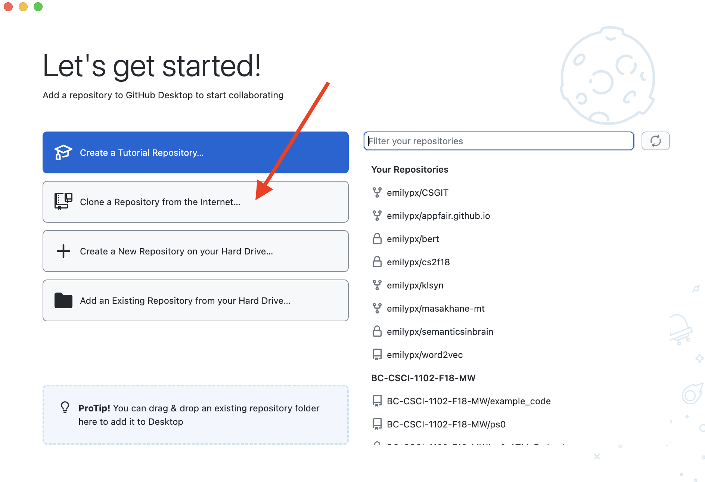

# GitHub Classroom Submission Guide

## Using GitHub Desktop
1. [Download GitHub Desktop from here.](https://desktop.github.com)
2. Find the installer in your Downloads folder (or wherever things get downloaded on your computer), then double click the installer to install GitHub Desktop. In most cases, this will install the program in your Downloads folder.
3. Launch GitHub Desktop. When you do this, it might ask you if you want to move it to a more appropriate location (e.g., Applications or Programs). You should agree to this, but remember where it is getting moved to so you can find it easily later! I suggest making a shortcut or alias on your Desktop.
4. Since you have already created a GitHub account in the first part of this problem set, you should sign in to GitHub.com when prompted, and authorize GitHub Desktop to access your GitHub Files.

## Part 4: Clone your copy of the repository to your own machine
This might be the trickiest part for many people. 

You are now going to use GitHub Desktop to make a copy of `ps1-yourusername` on your own computer. It will just look like a normal folder on your computer, but it will actually be connected to your copy of this repository on the internet on GitHub. You can add files and change files in that folder, and then you will use GitHub Desktop to make those changes to your repository on GitHub. The repository on GitHub is what the TAs and I will grade, rather than a submission on Canvas.

1. Launch GitHub Desktop if you closed it before. If you have not already logged in and authorized it to access your GitHub account, follow the instructions it provides to do so now.

2. You should see a screen like this. Click on the second choice "Clone a Repository from the Internet..."



3. When you select that, you'll see a list of your repositories, including this one, as shown below. Select this repository, i.e., `CSCI1090-S24/ps1-yourusername`, where `yourusername` is your GitHub username.

Then in the `Local Path` box, change the path to something sensible -- like your Desktop or Documents and then a folder named for the class, as shown in the screenshot below. **Be sure to remember what this location is so you can easily find your files later on!**


4. Next you'll see a screen like this. If you want to see your local copy of your repo on your computer, you can click on the `Show in Finder` option (which will be something like `Show in File Explorer` in Windows).
 


6. On my Mac, when I click on `Show in Finder` this is what I see next: a Finder folder with the same files as I can see on GitHub in my browser! This is your local copy of the problem set. This is where you will be doing all the work for this problem set. At the end of the problem set, in step 9, you'll see how to commit your work to your repository on the internet on GitHub.


If you look at your `ps1-yourusername` folder now, it should look like this, since you have added your slide, your screenshot, and your updates to  `ps1.py`.


Now you are ready to commit your changes from your local copy of the repo to the main copy of the repo on GitHub!

1. Launch GitHub Desktop.
2. It should look something like this, showing the files that have been added or changed on the left. If you don't see something like this, you should be able to find your current ps1 repo from the drop down menu in the upper left corner.


3. Type a message saying what changes you're making in the box that says `Summary (required)`. I typed "adding a slide and screenshot, updating ps1.py".

4. Click `Commit to main`.
5. Then you'll see this screen. Click the blue button that says `Push origin`.


6. Now you can double check that your changes to the repo on GitHub went through by clicking on `View on GitHub`:


## Using git from the command line
1. If you aren't sure whether you have `git` installed on your computer, [follow these directions for installing `git` on your computer](https://github.com/git-guides/install-git). You might already have it installed, so be sure to check as described in these instructions.

2. Clone the desired GitHub repo to your own computer. 

* Go to your repo on github.com and click the green Code button, then the copy button.
* Launch a terminal (on Mac: up to the maginfying glass and search for Terminal; on Windows: Start menu `cmd` or `command` or use git bash).
* In the terminal, navigate to where you'd like to keep your repos for this class (e.g., ``cd ~/Desktop/CSCI3349/``).
* Type ```git clone``` and then paste in what you copied, above in the first bullet.

3. Do any work that is required for the problem set and make sure it appears in your repo for the problem set or lab you are working on,

3. Now, in the terminal, navigate in the file system to the folder on your computer where you cloned this repo (e.g., ``cd ~/Desktop/CSCI3349/lab1-yourusername``).

4. The following three commands will submit all your new files and newly edited files:

``git add <filenames>``

``git commit -m "write a comment here about what you did"``

``git push``
